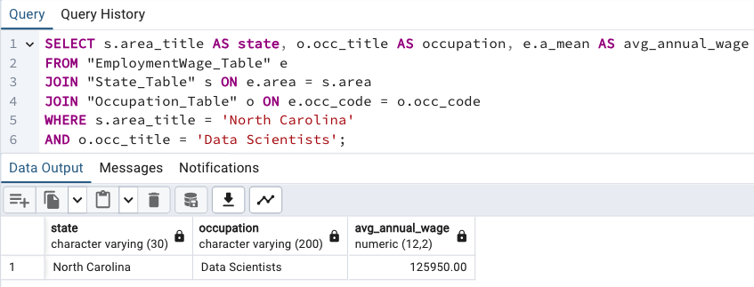
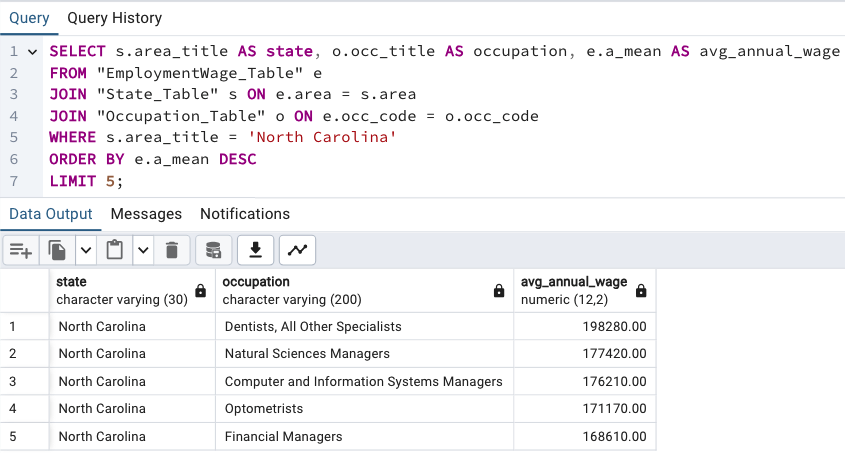

# OEWS Employment and Wage Data Project

This project focuses on analyzing and storing Occupational Employment and Wage Statistics (OEWS) data in a PostgreSQL database. The data, sourced from the Bureau of Labor Statistics (BLS), provides detailed information on employment, wages, and occupation statistics across various U.S. states.

## Project Overview

We used data from the May 2023 OEWS release, which offers employment and wage estimates for numerous occupations across the United States. This project entails loading the data into a relational database for querying and further analysis.

## Data Source

* **Occupational Employment and Wage Statistics (OEWS)**  
  Learn more about OEWS data [here](https://www.bls.gov/oes/oes_emp.htm).

* **Download May 2023 Data**  
  The May 2023 OEWS data is available for download [here](https://www.bls.gov/oes/tables.htm). Check the second tab for field descriptions.

* **OEWS Occupation Profiles**  
  Overview of the occupation categories in the dataset. [View here](https://www.bls.gov/oes/current/oes_stru.htm).

* **OEWS Documentation**  
  For technical notes and background methodology, [read here](https://www.bls.gov/oes/oes_doc.htm).

* **Frequently Asked Questions**  
  Access the FAQ for working with the OEWS data [here](https://www.bls.gov/oes/oes_ques.htm).

* **OEWS Maps**  
  Explore data visualizations [here](https://www.bls.gov/oes/current/map_changer.htm).

## Database Schema

The PostgreSQL database was designed to store the cleaned OEWS data, comprising three main tables: `EmploymentWage_Table`, `State_Table`, and `Occupation_Table`. Below is an entity-relationship diagram (ERD) illustrating the relationships between the tables.


## Database Table Descriptions

1. **EmploymentWage_Table**  
   Stores employment and wage data by state and occupation levels.  
   **Primary Key**: (area, occ_code)  
   **Foreign Keys**: area (references State_Table), occ_code (references Occupation_Table)

2. **State_Table**  
   Stores state-level geographic information.  
   **Primary Key**: area

3. **Occupation_Table**  
   Stores occupation details, including occupation codes and titles.  
   **Primary Key**: occ_code

## Database Usage Examples

1. Find the average wage of a "Data Scientist" in "North Carolina".


2. Find the Top 5 Highest Paying occupations in a specific state in "North Carolina".


## Setup Instructions

1. **Install Dependencies**  
   Install the required Python packages:

   ```bash
   pip install pandas psycopg2 python-dotenv
   ```

2. **Load the OEWS Data**  
   Download the OEWS Excel file and load it into a pandas DataFrame:

   ```python
   import pandas as pd
   all_oews_df = pd.read_excel("Data/all_data_M_2023.xlsx")
   ```

3. **Data Cleaning and Transformation**  
   Narrow the dataset to state-level data and clean it:

   ```python
   state_oews_df = all_oews_df[all_oews_df['AREA_TYPE'] == 2]
   clean_oews_df = state_oews_df[['AREA', 'AREA_TITLE', 'PRIM_STATE', 'OCC_CODE', ...]]
   renamed_oews_df = clean_oews_df.rename(columns={ ... })
   ```

4. **Export Cleaned Data to CSV**  
   Save the cleaned data as a CSV file:

   ```python
   renamed_oews_df.to_csv('data/EmploymentWageData.csv', index=False)
   ```

5. **Setup PostgreSQL Database**  
   Ensure PostgreSQL is installed and create the database schema:

   ```sql
   CREATE TABLE "State_Table" (...);
   CREATE TABLE "Occupation_Table" (...);
   CREATE TABLE "EmploymentWage_Table" (...);
   ```

6. **Run the ETL Process**  
   Establish a connection to the PostgreSQL database and load the cleaned data.

7. **Run Queries**  
   Use PostgreSQL to query employment and wage data for analysis.

## Database Connection Code Example

You can use `psycopg2` to connect to PostgreSQL:

```python
import psycopg2
import os

connection = psycopg2.connect(
    host=os.getenv('DB_HOST2'),
    port=os.getenv('DB_PORT2'),
    database=os.getenv('DB_NAME2'),
    user=os.getenv('DB_USER2'),
    password=os.getenv('DB_PASS2')
)
cursor = connection.cursor()
```

For more details, check the [Jupyter Notebook](SQL-Psycopg2.ipynb).

## Ethical Considerations

In this project, we adhered to the responsible use of publicly available data from the Bureau of Labor Statistics. Since the OEWS data is anonymized and aggregated, no personally identifiable information (PII) is included, ensuring privacy protection. We followed the BLS guidelines for public data access, aiming for transparency, accuracy, and clarity in reporting employment and wage data. The project highlights key economic trends while maintaining ethical standards in data usage and communication.

## Contributors

* Yen Lu
* Bryan HB
* Stephanie Ayala
* Nebiat Beyene
* Adebola Shellby  

## Code Sources

* Simon Kingaby
* UNC Bootcamp Data Analytics class resources
